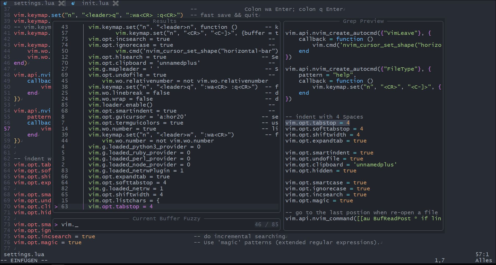
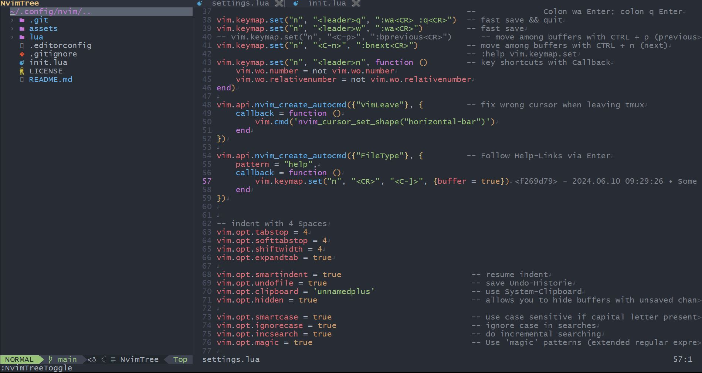

<h3 align="center"> Nvim </h3>

<p align="center">
My personal neovim configuration with 10 plugins & numerous keybinds written with lua using the lazy.nvim package manager.
</p>

## <!-- Small trick for a github README seperator. -->

### 🎐 Features

- **Simple.** Runs out of the box.
- **Modern.** Pure `lua` config.
- **Modular.** Easy to customize.

### Preview





### Requirements

- **fd**: Better "find" command
- **rg**: Better "grep" command
- **nerd font**: Font patched with icons
- **tmux**: Terminal multiplexer (optional)

### 🏗 Instalation

<details open><summary>Linux</summary>

```bash
git clone https://github.com/JBlond/nvim.git ~/.config/nvim
```

</details>

<details open><summary>Windows</summary>

```powershell
git clone -c core.autocrlf=false https://github.com/JBlond/nvim.git %userprofile%\AppData\Local\nvim\
```

</details>

#### Update plugins

Start neovim and run `:Lazy`

### Shortcuts

- **\<esc>**: Clear search highlights
- **\<alt-f>**: Grep files
- **\<ctrl-s>**: Write
- **\<ctrl-n>**: Next buffer
- **\<ctrl-p>**: Find files
- **\<ctrl-f>**: Find file contents
- **\<alt-t>**: Find TODO: in file contents
- **\<space>w**: Write
- **\<space>q**: Write & quit
- **\<space>n**: Toggle relative line numbers
- **\<space>jf**: Jump to files
- **\<space>sf**: Toggle file tree
- **\<space>he**: Search help pages
- **\<ctrl-k>**: Toggle screen key feature

### Extra

When using neovim within tmux the cursor will change when exiting tmux. To prevent that add this to your "tmux.conf".

```ini
# Always use 256 colors.
set -g default-terminal 'tmux-256color'
# this is for 256 color.
set -ga terminal-overrides ',*:Tc'
# This is for the cursor shape (3 = blinking underscore, 1 = solid block).
set -ga terminal-overrides '*:Ss=\E[%p3%d q:Se=\E[ q'
```

### License

A short and simple permissive license with conditions only requiring preservation of
copyright and license notices. Licensed works, modifications, and larger works may be
distributed under different terms and without source code.

For more see [MIT LICENSE](LICENSE)
