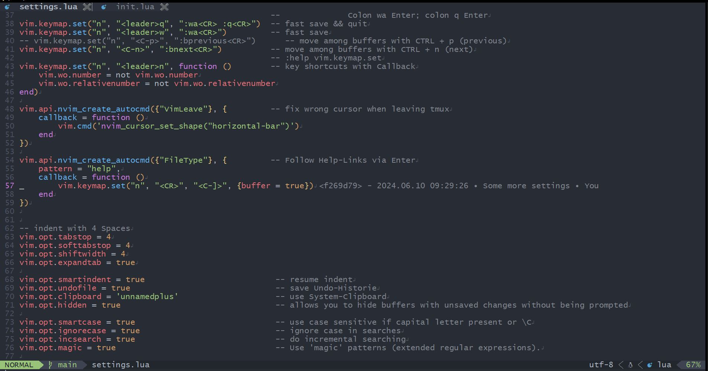

# nvim

My neovim / nvim config

```bash
# Linux
git clone https://github.com/JBlond/nvim.git ~/.config/nvim
# windows
git clone -c core.autocrlf=false https://github.com/JBlond/nvim.git %userprofile%\AppData\Local\nvim\
```



## shortcuts

- `<space>w` fast save
- `<space>q` fast save + quit / close
- `<space>n` toggle relative line numbers
- `<ESC>` finish search highlighting
- `<CTRL>n` next buffer
- `<CTRL>p` previous buffer

## Plugins

### nvim-tree

- `<space>sf` Toggle nvim tree (sf = show files)
- `<space>jf` Jumpt to file

### Telescope

- `<space>he` Telescope help pages
- `<space>ff` find files
- `<space>fi` find inside the file
- `<space>fg` find grep

### Plugin Management

```vim
:Lazy
```

## Windows neovim install

```powershell
winget install --id Microsoft.Powershell --source winget
winget install --id "Neovim.Neovim"
npm install -g neovim
winget install python3
winget install --id "BurntSushi.ripgrep.GNU"
winget install sharkdp.fd
```

## Linux external programms

```
sudo apt install fd-find ripgrep
